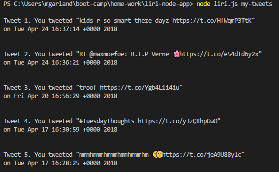
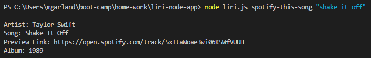
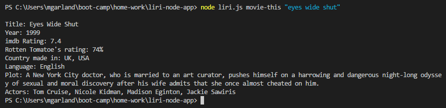
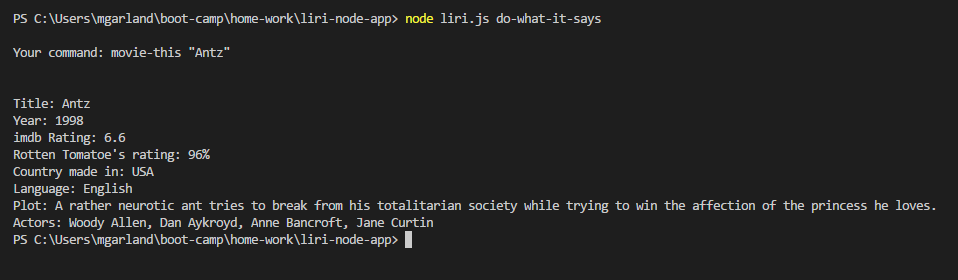

# liri-node-app
 LIRI is a Language Interpretation and Recognition Interface. It was developed as part of my full-stack web-development course at Gerogia Tech.

# How to use?
LIRI is used from the command line. Navigate to the folder containing the 'liri.js' file and use the following commands to operate LIRI.

All commands begin with 'node liri.js'.

## **'my-tweets'**
Use the command 'node liri.js my-tweets' to display my last twenty tweets. If I ever bother to tweet that much.

_e.g._ node liri.js my-tweets 

## **'spotify-this-song'**
Use the command ' node liri.js spotify-this-song "_insert_ _song_ _query_ _here_" ' to search Spotify's library and return information on the song queried.

_e.g._ node liri.js spotify-this-song "shake it off" 

If no query is made then LIRI will return information on the greatest song released in 1993 from a Swedish band when the day was October 29th.

## **'movie-this'**
Use the command ' node liri.js movie-this "_insert move title here_" ' to return information on the movie of your choice.

_e.g._ node liri.js movie-this "eyes wide shut" 

If no query is made then LIRI will return information obout "Mr. Nobody". I hear it's pretty good.

## **'do-what-it-says'**
Use the command ' node liri.js do-what-it-says' to run the command from the 'random.txt' file

_e.g._ node liri.js do-what-it-says

# liri-log.txt
Commands and data returned will be logged in the 'liri-log.txt' file